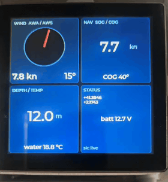

# esp32-boat-mfd

[](https://github.com/navado/esp32-boat-mfd/actions/workflows/ci.yml)
[](https://github.com/navado/esp32-boat-mfd/actions/workflows/release.yml)
[](LICENSE)
[](https://platformio.org)
[](#hardware)
[](https://signalk.org)

A wireless marine multi-function display (MFD) for the Sunton/Guition
**ESP32-4848S040** 4.0″ 480×480 IPS touchscreen. Acts as a SignalK
client over WiFi, with BLE debug, OTA updates, and a 4-quadrant LVGL UI.

<p align="center">
  <a href="docs/demo.mp4">
    
  </a>
  <br>
  <em>Live SignalK data — wind, navigation, depth, position, battery. Click for full-quality MP4.</em>
</p>

## Highlights

- Boats up to ~£20M of yacht-style equipment in a $30 board
- SignalK over WebSocket (subscribes to wind / nav / depth / battery)
- WiFi STA with AP fallback for provisioning
- OTA firmware update over WiFi (no USB cable for iteration)
- BLE Nordic UART for diagnostics + commands (works without WiFi)
- UDP log broadcast for `nc -u -l 9999` from any LAN host
- LVGL 9 UI: 480×480, 4 quadrants, 5 Hz refresh

## Hardware

| Item | Detail |
|------|--------|
| Board | Sunton / Guition **ESP32-4848S040** (also labelled `ESP32-4840S040`) |
| MCU | ESP32-S3-WROOM-1 **N16R8** (16 MB flash + 8 MB octal PSRAM) |
| Display | 4.0″ IPS 480×480, ST7701 RGB parallel |
| Touch | GT911 capacitive, I²C on SDA=19 SCL=45 |
| Storage | microSD slot |
| USB | USB-C with CH340 USB-UART (caution: flaky chip — use OTA after first flash) |
| Optional | 3-channel mains-rated relay daughterboard on edge header |

## Quick start

```sh
# 1. Clone + open
git clone https://github.com/navado/esp32-boat-mfd.git
cd esp32-boat-mfd

# 2. (Optional) Pre-set WiFi credentials in include/secrets.h
cp include/secrets.h.example include/secrets.h

# 3. First flash over USB
pio run -t upload

# 4. Set WiFi creds via serial (or via the AP fallback)
pio device monitor
# in monitor:  wifi <ssid> <password>
# the device reboots and joins your network, prints its IP

# 5. From now on, flash over WiFi:
pio run -e ota -t upload --upload-port <device-ip>
```

## Configuration

### Console commands

Send these over Serial (115200) or BLE (Nordic UART, characteristic `6e400002-…`):

| Command | What it does |
|---------|--------------|
| `wifi <ssid> <password>` | Save WiFi credentials and reboot |
| `wifi-forget` | Clear credentials, fall back to AP `espdisp-setup` |
| `ip` | Print current IP / mode / RSSI |
| `scan` | List visible 2.4 GHz networks (ESP32-S3 is 2.4 GHz only) |
| `sk <host> [port]` | Save SignalK server target and reboot |
| `sk-status` | Print SignalK connection state + last delta age |
| `sk-dump` | Print current values of all parsed SignalK fields |
| `reboot` | Soft restart |

### BLE access

The device advertises as `espdisp` with the Nordic UART service
(`6E400001-B5A3-F393-E0A3-9F4DD9E3A05A`). Subscribe to the TX characteristic
`6E400003-…` to stream logs; write UTF-8 strings to RX `6E400002-…` for commands.

Helper script: `tools/ble_console.py` — Python + `bleak`:

```sh
python3 tools/ble_console.py sk-status     # one command
python3 tools/ble_console.py               # interactive (default: ip + sk-status)
```

### UDP log

Once on a non-isolated WiFi (i.e. not iOS Personal Hotspot), the device
broadcasts log lines on UDP/9999:

```sh
nc -u -l 9999
```

## Demo data

For development without a real boat:

```sh
docker run -d --name signalk-server -p 3000:3000 \
  -v /tmp/sk-config:/home/node/.signalk \
  signalk/signalk-server:latest

python3 tools/fake_boat.py <signalk-host> 3000
```

`fake_boat.py` pushes synthetic deltas for wind / nav / depth / battery
once per second so the dashboard gauges have something to draw.

## Architecture

```
                 +-------------------+
                 |  ESP32-4848S040   |
                 |  ESP32-S3-N16R8   |
                 +---------+---------+
                           |
        +---- WiFi --------+--------- BLE --------+
        |                                         |
        v                                         v
 SignalK WebSocket                           Nordic UART
 ws://host:3000/                             (logs + commands)
 signalk/v1/stream
        |
        v
 +------+---------+
 | signalk_parser | -- applyDelta(json, Data) ----> sk::data
 +----------------+
        |
        v
 +----------------+
 |   LVGL UI      | -- 5 Hz refresh from sk::data
 |  4 quadrants   |
 +----------------+
```

| File | Purpose |
|------|---------|
| `src/main.cpp` | Display + touch init, LVGL UI, main loop |
| `src/net.cpp` | WiFi STA/AP, ArduinoOTA, mDNS, BLE GATT, multi-target logging |
| `src/signalk.cpp` | WebSocket client, subscription, NVS-persisted host |
| `src/signalk_parser.cpp` | Pure delta-parsing (host-testable) |
| `include/board_pins.h` | GPIO map for ESP32-4848S040 |
| `include/lv_conf.h` | LVGL build configuration |
| `include/secrets.h.example` | Template for WiFi credentials |
| `tools/ble_console.py` | BLE debug / config tool |
| `tools/fake_boat.py` | Synthetic SignalK data pusher |

## Testing

Host-side unit tests for the SignalK delta parser:

```sh
pio test -e native
```

The parser is a pure function (`sk::applyDelta`) with no Arduino dependencies,
so it builds and runs on macOS / Linux. CI runs these on every push.

## OTA workflow

1. Get device IP from `ip` command (Serial or BLE)
2. `pio run -e ota -t upload --upload-port <ip>`
3. PlatformIO uses ArduinoOTA on port 3232 (no auth by default — set
   `OTA_PASSWORD` in `secrets.h` for production)

## Roadmap

- [ ] Multi-page UI (wind page / nav page / engine page) with swipe
- [ ] AIS targets overlay
- [ ] NMEA 0183 input via RS-422 transceiver on a free UART
- [ ] Optional NMEA 2000 (CAN) support
- [ ] Anchor watch alarm with relay-driven horn
- [ ] Persist last-known values to NVS so the UI isn't blank on boot

## Similar projects

- [`pypilot/pypilot_mfd`](https://github.com/pypilot/pypilot_mfd) — ESP32-S3 MFD with NMEA0183 + SignalK + pypilot (GPL family, broader scope)
- [`mxtommy/Kip`](https://github.com/mxtommy/Kip) — popular web-based SignalK instrument package
- [`mrstas/SC01_PLUS_MARINE_INSTRUMENTS`](https://github.com/mrstas/SC01_PLUS_MARINE_INSTRUMENTS) — same idea on Panlee SC01 Plus
- [`SignalK/SensESP`](https://github.com/SignalK/SensESP) — sensor-side framework (good companion)

## Contributing

See [`CONTRIBUTING.md`](CONTRIBUTING.md). Bug reports and PRs welcome.

## License

[MIT](LICENSE) © 2026 Boris Sorochkin and contributors.

Built on top of LVGL (MIT), Arduino_GFX (MIT), NimBLE-Arduino (Apache 2.0),
WebSockets (LGPL-2.1), ArduinoJson (MIT), and Arduino-ESP32 (LGPL-2.1).
