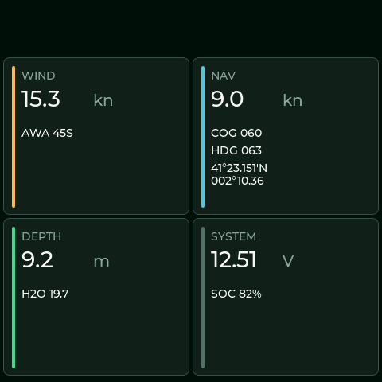
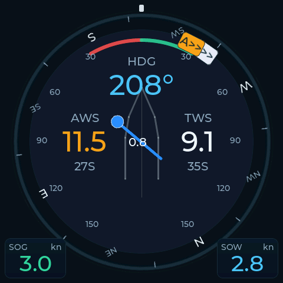
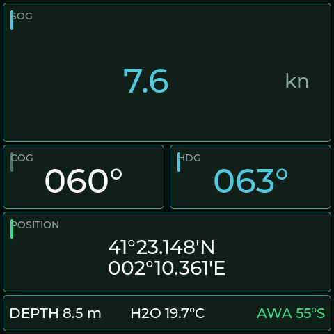
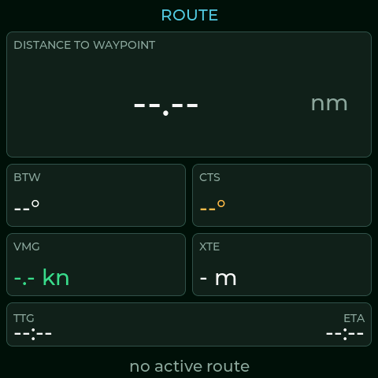
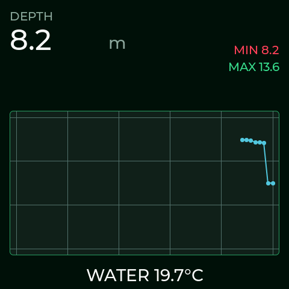
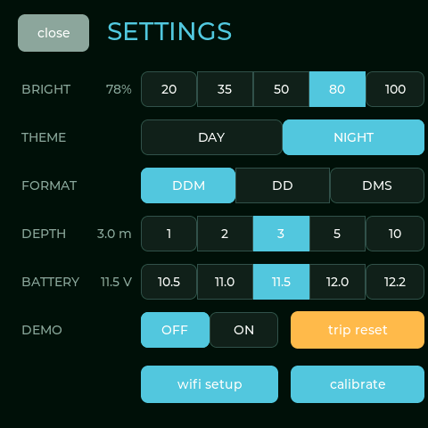
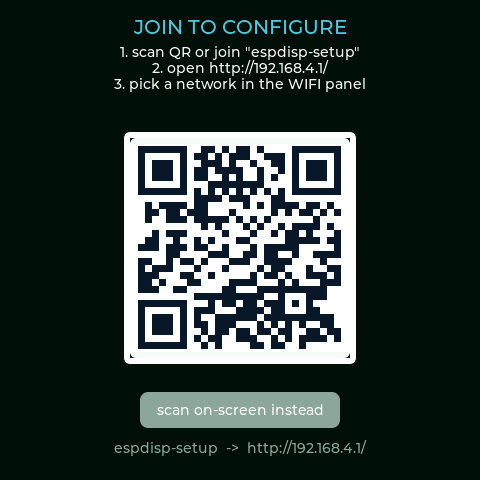
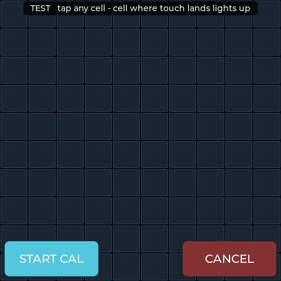
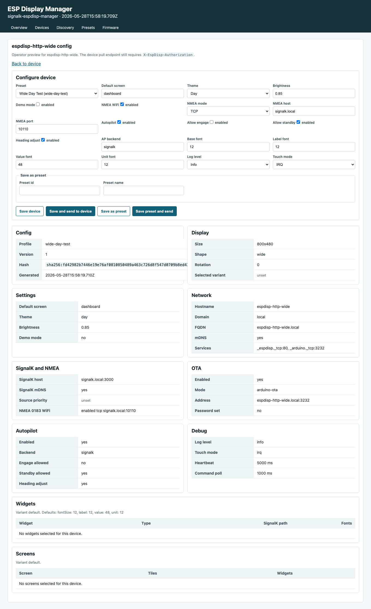
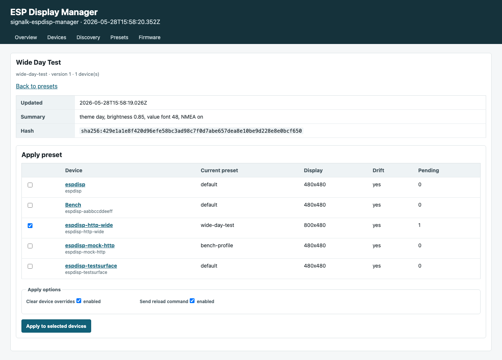

# esp32-boat-mfd

[](https://github.com/navado/esp32-boat-mfd/actions/workflows/ci.yml)
[](https://github.com/navado/esp32-boat-mfd/actions/workflows/release.yml)
[](LICENSE)
[](https://platformio.org)
[](#hardware)
[](https://signalk.org)

A source-available marine multi-function display (MFD) firmware for the
ESP32-S3 family of touch panels. Acts as a [SignalK](https://signalk.org)
WebSocket client and renders live navigation data on an LVGL dashboard.

The current development line also includes a repo-owned SignalK lab stack and
an experimental SignalK plugin for centralized ESP display registration,
profiles, widget layout, commands, and firmware update orchestration. The
plugin side is test-covered, and the firmware now has an MVP manager client
for registration, heartbeats, config pull, command polling, and pull OTA.
Real-boat validation and security hardening are still in progress.

Licensed under [PolyForm Noncommercial 1.0.0](LICENSE) — free for
personal, research, educational, and other noncommercial use.
**Commercial use requires a separate license** (see [Commercial use](#commercial-use)).

<p align="center">
  <a href="docs/demo.mp4">
    
  </a>
  <br>
  <em>Live SignalK data — wind, navigation, depth, position, battery. Click for full-quality MP4.</em>
</p>

<p align="center">
  
  
  
  
  <br>
  
  
  
  
  <br>
  <em>System-test screenshots captured from the device/test harness artifacts.</em>
</p>

## Features

- **SignalK over WebSocket** — subscribes to navigation, wind, depth, water temp, battery, tanks, route, and autopilot state
- **9 fullscreen screens** — Dashboard, Wind (compass rose + AWA/TWA arrows + tac sectors), Nav (huge SOG + DDM position), Depth (chart history + alarm bands), Steering (heading bug + CTS + XTE bar), Route (DTW/BTW/CTS/XTE/VMG/TTG/ETA), Autopilot (PUT to SignalK target/state), Trip (NVS-persisted distance/time/avg/max), System health
- **Swipe navigation** — horizontal swipes cycle screens; bottom swipe jumps to Dashboard
- **Day / night theme** — `theme day|night` console command, persisted in NVS
- **On-screen WiFi setup** — touch-keyboard SSID scan + password entry, no cable needed
- **MOB + alarms** — global overlays available from every screen
- **Touch diagnostics** — touch calibration/grid screens and GT911 interrupt/config-dump validation specs
- **Over-the-air updates** — ArduinoOTA on port 3232 (no USB cable for iteration)
- **BLE diagnostics + config** — Nordic UART service for logs + a structured Connection/Configuration GATT for companion apps
- **SignalK lab stack** — Dockerized SignalK server with official NMEA 0183 TCP and autopilot emulator plugins for repeatable testing
- **Experimental ESP display manager** — local SignalK plugin for device registry, provisioning, profiles, widget configs, command queues, firmware catalog/jobs, and a dashboard UI
- **Multi-target logging** — Serial / UDP broadcast / BLE notify, the same `logf()` writes to all three
- **Host-portable parser** — SignalK delta logic builds and tests on macOS / Linux as well as the device
- **CI + release automation** — GitHub Actions builds firmware and the SignalK plugin package on every push; tagged releases attach firmware binaries plus the matching plugin tarball

## Project status

This repository is suitable for lab testing and firmware/plugin development.
It is not yet a production navigation instrument.

| Area | Status |
|------|--------|
| ESP32 display firmware | Active; core screens, touch UI, WiFi, BLE, OTA, SignalK ingest, and diagnostics exist |
| SignalK local test stack | Active; `make demo-up` starts the configured SignalK container |
| NMEA 0183 over WiFi | Configured through the official `@signalk/signalk-to-nmea0183` plugin on TCP `10110` |
| Autopilot simulator | Configured through the official `@signalk/signalk-autopilot` emulator backend |
| ESP display manager plugin | Experimental but implemented and covered by local plugin tests |
| Firmware manager client | MVP implemented; opt-in contract tests exist; real-network validation and hardening remain |
| OTA fleet management | MVP implemented; plugin-side artifact/job model and firmware pull/apply path exist; hardware failure-path validation remains |

## Architecture Overview

The project has two cooperating halves:

- **ESP display firmware** runs on the touch panel. It renders the local UI,
  ingests SignalK/NMEA data, exposes diagnostics over serial/BLE/UDP, supports
  OTA, and includes a manager client that can register with SignalK, fetch a
  generated config, poll commands, report status, and run pull-based firmware
  updates.
- **SignalK lab and manager stack** runs on the development machine or boat
  server. It provides synthetic data, NMEA 0183 TCP output, an autopilot
  emulator, and the repo-owned `espdisp-manager` plugin for fleet-style display
  management.

The manager plugin is the control plane for configuring ESP display dashboards
from SignalK:

```text
SignalK server
  espdisp-manager plugin
    registry          known devices, status, display geometry, capabilities
    dashboard presets reusable screen/theme/widget configs for similar devices
    generated config  per-device dashboard merge of preset + overrides
    commands          reload dashboard config, screen actions, firmware actions
    firmware catalog  vendor/product/version metadata and OTA jobs

ESP display firmware
  register -> fetch config -> render -> heartbeat/status -> poll commands
```

Devices are not expected to receive arbitrary JSON from the operator UI.
Operators use structured pages:

- `Devices` lists registered panels, health, selected dashboard preset,
  display size, config drift, and pending commands.
- `Device config` edits a single dashboard from SignalK: preset assignment,
  day/night theme, brightness, NMEA WiFi source, autopilot widgets, widget font
  sizes, touch/debug mode, and per-device overrides.
- `Presets` manages reusable dashboard configurations so several panels of the
  same size or role can share a common setup. Presets can be imported/exported
  as JSON or YAML for review and version control.
- `Preset detail` applies one dashboard preset to selected devices and can
  queue `config.reload` so the devices pull the new generated dashboard config.
- The device web UI exposes matching dashboard config import/export endpoints:
  `/api/dashboard/config.json` and `/api/dashboard/config.yaml`.
- `Firmware` tracks plugin-side firmware artifacts and OTA jobs; the firmware
  can pull, verify, install, reboot, and confirm jobs, with hardware
  failure-path validation still outstanding.

Current SignalK dashboard-configuration screenshots:

<p align="center">
  
  
  <br>
  
  
  <br>
  
  
</p>

## Hardware

Primary target:

| Component | Detail |
|-----------|--------|
| Board | Sunton / Guition **ESP32-4848S040** (also labelled `ESP32-4840S040`) |
| MCU | ESP32-S3-WROOM-1 **N16R8** — 16 MB flash + 8 MB octal PSRAM |
| Display | 4.0″ IPS 480×480, ST7701 RGB parallel |
| Touch | GT911 capacitive, I²C `SDA=19 SCL=45` |
| Storage | microSD slot |
| USB | USB-C with CH340 USB-UART |

Additional ESP32-S3 RGB touch profiles now compile through the same board
abstraction and report their geometry to the device identity/status APIs:

| PlatformIO env | Board profile | Display | Layout class |
|----------------|---------------|---------|--------------|
| `waveshare-touch-lcd-4` | Waveshare Touch LCD 4 | 480x480 square | `square-480` |
| `waveshare-touch-lcd-4_3` | Waveshare Touch LCD 4.3 | 800x480 landscape | `landscape-800x480` |
| `waveshare-touch-lcd-4_3b` | Waveshare Touch LCD 4.3B | 800x480 landscape | `landscape-800x480` |
| `waveshare-touch-lcd-5_800x480` | Waveshare Touch LCD 5 | 800x480 landscape | `landscape-800x480` |
| `waveshare-touch-lcd-5_1024x600` | Waveshare Touch LCD 5 | 1024x600 landscape | `landscape-1024x600` |
| `waveshare-touch-lcd-7_800x480` | Waveshare Touch LCD 7 | 800x480 landscape | `landscape-800x480` |
| `waveshare-touch-lcd-7b_1024x600` | Waveshare Touch LCD 7B | 1024x600 landscape | `landscape-1024x600` |

These profiles share the current RGB/LVGL initialization path. They are build
profiles and geometry/layout contracts until each physical board passes the
hardware checklist for panel timing, backlight, touch coordinates, rotation,
CAN/RS485 exposure, SignalK connectivity, and dashboard rendering.

```sh
pio run -e waveshare-touch-lcd-4
pio run -e waveshare-touch-lcd-7b_1024x600
```

The firmware reports board metadata including resolution, shape, density,
layout class, usable area, display bus, touch controller, touch interrupt, and
NMEA 2000 CAN capability so the SignalK manager can select presets by geometry
instead of hardcoded board names.

## Onboard setup

Normal boat installs should use firmware and plugin artifacts built by this
repository's GitHub Actions workflows, not ad-hoc local builds.

Stable release path:

1. Open the
   [latest GitHub release](https://github.com/navado/esp32-boat-mfd/releases).
2. Download the merged firmware image for the physical board, for example
   `esp32-4848s040-merged_firmware.bin` or
   `waveshare-touch-lcd-7b_1024x600-merged_firmware.bin`.
3. Download `signalk-espdisp-manager-<version>.tgz` for the SignalK plugin.
4. Verify artifacts with the release `SHA256SUMS` file.
5. Flash the display over USB:

```sh
esptool.py --chip esp32s3 --port /dev/cu.usbserial-* write_flash 0x0 <target>-merged_firmware.bin
```

6. Install the plugin on the boat SignalK server:

```sh
cd ~/.signalk
npm install /path/to/signalk-espdisp-manager-<version>.tgz
```

7. Restart SignalK, then enable **ESP Display Manager** in the SignalK admin
   plugin UI if you want centralized display management.
8. Provision the display onto the boat WiFi and SignalK server from serial or
   BLE:

```text
wifi <boat-ssid> <boat-wifi-password>
sk <signalk-host-or-ip> 3000
```

Latest CI artifact path:

- Firmware artifacts are attached to successful CI runs as
  `firmware-<platformio-env>-latest`, for example
  `firmware-esp32-4848s040-latest` or
  `firmware-waveshare-touch-lcd-7b_1024x600-latest`.
  Each artifact includes `merged_firmware.bin` for first USB flashing plus
  `firmware.bin`, `firmware.elf`, `bootloader.bin`, and `partitions.bin`.
- The plugin package artifact is named `signalk-espdisp-manager-<git-sha>`.
- CI artifacts are useful for testing current `main` or newer board profiles;
  releases remain the preferred stable boat install source.

For the full onboard checklist and network model, see
[Boat setup](docs/boat-setup.md). For development-only lab workflows, see
[Running with synthetic data](#running-with-synthetic-data) and
[Lab topology](docs/lab-topology.md).
For managed-display registry/config/command concepts, see
[SignalK ESP Display Manager](docs/signalk-espdisp-manager.md).
For the full status and upcoming work, see the [project roadmap](docs/roadmap.md).

## Development make targets

These targets are for development, testing, and local flashing.  Normal onboard
installs should start from the CI/release artifacts described above.

```
make help          List all targets
make setup         First-time setup (PlatformIO check + secrets.h)
make build         Build firmware
make test          Run host-side unit tests
make flash         Flash over USB (auto-detects /dev/cu.usbserial-*)
make ota              Flash over WiFi  (DEVICE_IP defaults to espdisp.local)
make monitor          Open serial monitor
make ble              Open BLE console (logs + commands without WiFi)
make logs             Listen for UDP log broadcasts on :9999
make demo-up          Start SignalK + synthetic data in local Docker
make demo-down        Stop the local demo stack
make demo-up-remote   Start SignalK on nav-server over SSH+Docker
make demo-down-remote Stop the remote stack
make sys-test-remote  Source .env.test and run system tests against the lab rig
make lint          Check formatting + Python syntax
make format        Auto-format C++ sources
make backup        Dump device flash to backup/full_flash_16MB.bin
make release-tag   Tag a release locally (VERSION=v0.1.0)
make clean         Remove build artifacts
```

## Versioning

`VERSION` is the project version source. `tools/check_version.py` verifies
that it matches the SignalK plugin package metadata. PlatformIO runs
`tools/version.py` before each build and injects:

- `FW_VERSION` from `VERSION`, or `ESPDISP_VERSION` when set by release CI.
- `FW_GIT_COMMIT` from `GITHUB_SHA` or local Git.
- `PIO_ENV` from the active PlatformIO environment.

The firmware exposes those fields through device identity, mDNS discovery,
manager registration, `/api/state`, and OTA confirmation payloads. The
SignalK plugin reports its version from its `package.json`.

Local version commands:

```sh
make version-check
make version-set VERSION=0.1.1
make build
make build PROJECT_VERSION=0.1.1-dev
```

Release tags must match the `VERSION` file, for example `v0.1.0`. Tagged
GitHub releases build every supported firmware target, package the matching
`signalk-espdisp-manager-<version>.tgz` plugin, and publish checksums for all
release artifacts. Use those release assets for normal SignalK installs.

To install the SignalK plugin from the release asset or build a local package,
see
[SignalK plugin install](signalk/README.md#install-esp-display-manager-from-this-repo).

## Console commands

Send these over the serial monitor (`make monitor`) or BLE (`make ble`):

| Command | Effect |
|---------|--------|
| `wifi <ssid> <pass>` | Save WiFi credentials and reboot |
| `wifi-forget` | Clear credentials, fall back to AP `espdisp-setup` |
| `ip` | Print current IP / mode / RSSI |
| `id` / `id <name>` / `id auto` | Show, set, or restore the hardware-derived device id |
| `scan` | List visible 2.4 GHz networks |
| `sk <host> [port]` | Save SignalK server target and reboot |
| `sk-status` | Print SignalK connection state + age of last delta |
| `sk-dump` | Print currently-parsed values of every tracked field |
| `screen <id\|next\|prev\|N>` | Switch screens (ids: dashboard wind nav depth steering route autopilot trip status wifi) |
| `theme <day\|night>` | Switch palette (saved to NVS) |
| `pos-format <ddm\|dd\|dms>` | Lat/lon formatting; ddm is marine default |
| `trip-reset` | Zero trip distance / time / max-speed |
| `mob` / `mob-clear` | Trigger / clear Man Overboard |
| `demo [N]` / `demo-off` | Auto-cycle screens every N seconds |
| `fps` / `bench` | Toggle FPS overlay / dump rendering stats |
| `reboot` | Soft restart |

## BLE access

The device advertises as `espdisp` with **two** GATT services:

### 1. Nordic UART (text console)

UUID `6E400001-B5A3-F393-E0A3-9F4DD9E3A05A` — line-oriented, same commands
as the serial console. Subscribe to TX `6E400003-…` for streamed logs;
write UTF-8 lines to RX `6E400002-…`.

```sh
make ble                       # sends `ip` + `sk-status`, then streams logs
make ble-cmd CMD="sk-status"   # one-shot command
```

### 2. boat-mfd config service (structured)

Service UUID `a3f7e000-7a6b-4f47-b3a5-c4d2e5f6a000` — intended for a
companion mobile app (task #26).

| Characteristic | UUID suffix | Props | Payload |
|---|---|---|---|
| **CONNECTION** | `…e001…` | Read · Write · Notify | JSON: `{ "wifi": {ssid, ip, rssi, mode}, "sk": {host, port, state}, "device": {uptime_ms, heap_free, psram_free} }` |
| **CONFIGURATION** | `…e003…` | Read · Write · Notify | Layout JSON (same schema as the SignalK resource at `configuration.boat-mfd.layouts`), up to 512 B |

Write to CONNECTION with a partial JSON to update WiFi or SignalK target:

```jsonc
{ "wifi": { "ssid": "MyHomeNet", "password": "secret" } }   // saves + reboots
{ "wifi": { "forget": true } }                              // clears creds + reboots
{ "sk": { "host": "192.168.1.100", "port": 3000 } }          // saves + reboots
```

Write to CONFIGURATION with a complete layout JSON to replace the live config.
Reads return the last successfully applied document **only if it fits in 512
bytes** (the BLE attribute-value cap per the BT spec). Larger layouts return
a JSON summary stub:

```json
{ "truncated": true, "size": 917, "screen_count": 1, "alarm_count": 2,
  "default_screen": "dashboard" }
```

For full-layout transfer above 512 B, smartphone apps should use SignalK's
REST endpoint (`PUT /signalk/v1/api/vessels/self/configuration/boat-mfd/layouts/value`)
and trigger a re-load via the device's `layout-fetch` command. Native BLE
chunked transfer is on the roadmap (see task #20).

## Running with synthetic data

The local and remote demo stacks are for development and repeatable testing.
For a real boat network, use [Boat setup](docs/boat-setup.md) instead.

To exercise the firmware without a boat:

```sh
make demo-up
#   - starts signalk/signalk-server in Docker on :3000
#   - launches tools/fake_boat.py that pushes sinusoidal nav data
make demo-down
```

`fake_boat.py` connects to SignalK as an authenticated provider and emits
deltas for navigation, wind, depth, water temperature, battery, and tanks
once per second.

### Development lab rig (remote SignalK + dedicated AP)

The remote lab workflow is intentionally separate from the onboard setup. It
uses a Docker-capable Linux mini-PC (`nav-server`) to run SignalK and broadcast
a dedicated `esp-lab` AP for repeatable development tests. My lab host is a
[Compulab IOT-GATE-IMX8PLUS industrial ARM IoT gateway](https://www.compulab.com/products/iot-gateways/iot-gate-imx8plus-industrial-arm-iot-gateway/).

See [Lab topology](docs/lab-topology.md) for the full development diagram,
remote demo commands, `nav-server` setup, and Router/Starlink/etc. WAN-router
routing notes. Normal boat installs should use [Boat setup](docs/boat-setup.md).

### NMEA 0183 over WiFi

The demo SignalK server can also expose NMEA 0183 over WiFi using the official
SignalK plugin `@signalk/signalk-to-nmea0183`.

Configured service ports:

```text
SignalK HTTP/WebSocket: 3000/tcp
NMEA 0183 TCP:         10110/tcp
```

The plugin converts SignalK deltas to NMEA 0183 and publishes them through
SignalK's built-in `nmea-tcp` interface. In the local test server, the plugin
is configured with every supported conversion enabled at a 1000 ms minimum
interval; sentences only emit when their required SignalK paths have data.

Useful test:

```sh
nc localhost 10110
```

Expected demo output includes `GGA`, `RMC`, `HDT`, `MWV`, `VWR`, `VWT`, `DBT`,
and `MTW` when `tools/fake_boat.py` is pushing data.

If rebuilding the local SignalK container from scratch, install and enable:

```sh
./signalk/scripts/run.sh
```

The repo-owned config in `signalk/config` installs and enables:

```text
@signalk/signalk-to-nmea0183
Server setting: interfaces.nmea-tcp = true
```

### Autopilot command simulator

SignalK can run an autopilot simulator using the official plugin
`@signalk/signalk-autopilot` with its `emulator` backend. This gives the
firmware a queryable endpoint for testing autopilot commands without a real
pilot on the network.

Install and enable it with the repo-owned SignalK test config:

```sh
./signalk/scripts/run.sh
```

The config in `signalk/config/plugin-config-data/autopilot.json` enables:

```text
@signalk/signalk-autopilot
type: emulator
```

Useful query paths:

```text
/signalk/v1/api/vessels/self/steering/autopilot/state/value
/signalk/v1/api/vessels/self/steering/autopilot/target/headingMagnetic/value
```

Authenticated PUTs to `steering.autopilot.state` can be verified by reading
the state path back. The emulator also supports `actions.adjustHeading`; the
current firmware target-heading command uses `target.headingTrue`, which is
not the emulator's writable heading target.

## Layout configuration (work in progress)

Multi-screen layouts are described by a JSON document on the SignalK server
(`configuration.boat-mfd.layouts`). The device fetches the config at boot,
falls back to a baked-in default if unreachable, and re-fetches on reconnect.

### Schema

```jsonc
{
  "version": 1,
  "settings": {
    "default_screen": "dashboard",
    "demo_period_ms": 3000
  },
  "screens": [
    {
      "id": "dashboard",
      "title": "Dashboard",
      "type": "quadrants",
      "tiles": [
        {
          "id": "wind",
          "title": "WIND",
          "type": "wind",
          "paths": {
            "awa": "environment.wind.angleApparent",
            "aws": "environment.wind.speedApparent"
          }
        }
      ]
    },
    {
      "id": "steering",
      "title": "Steering",
      "type": "steering",
      "paths": {
        "hdg": "navigation.headingTrue",
        "cts": "navigation.courseRhumbline.courseToSteer",
        "xte": "navigation.courseRhumbline.crossTrackError"
      }
    }
  ],
  "alarms": [
    {
      "id": "shallow",
      "path": "environment.depth.belowTransducer",
      "level": "alarm",
      "lt": 3.0,
      "message": "SHALLOW WATER"
    }
  ]
}
```

### Field reference

| Field | Allowed values |
|-------|----------------|
| `screens[].type` | `quadrants` &middot; `steering` &middot; `autopilot` &middot; `route` &middot; `trip` &middot; `chart` |
| `screens[].tiles[].type` | `wind` &middot; `nav` &middot; `depth_temp` &middot; `device_status` &middot; `big_number` &middot; `compass` |
| `alarms[].level` | `info` &middot; `warn` &middot; `alarm` &middot; `emergency` |
| `alarms[].lt` / `.gt` | Number — trigger when the path's value crosses below `lt` or above `gt` |

Bounds (compile-time, see `include/layout.h`): max 8 screens, 4 tiles per
screen, 6 path bindings per object, 8 alarms. Strings truncate to 32
chars for ids/titles, 96 for SignalK paths.

### Status

- Schema defined + host-portable parser with 9 unit tests passing — `include/layout.h`, `src/layout.cpp`
- Fetcher (SignalK REST) and LVGL renderer not yet wired (tracked in task #7)

## Architecture

```
                 +-------------------+
                 |  ESP32-4848S040   |
                 |  ESP32-S3-N16R8   |
                 +---------+---------+
                           |
        +---- WiFi --------+--------- BLE --------+
        |                                         |
        v                                         v
 SignalK WebSocket                          Nordic UART
 ws://host:3000/                            (logs + commands)
 signalk/v1/stream
        |
        v
 +------+---------+
 | signalk_parser | -- applyDelta(json, Data) ----> sk::data
 +----------------+
        |
        v
 +----------------+
 |   LVGL UI      | -- 5 Hz refresh from sk::data
 |  4 quadrants   |
 +----------------+
```

| File | Purpose |
|------|---------|
| `src/main.cpp` | Display + touch init, LVGL UI, main loop |
| `src/net.cpp` | WiFi STA/AP, ArduinoOTA, mDNS, BLE GATT, multi-target logging |
| `src/signalk.cpp` | WebSocket client, subscription, NVS-persisted target |
| `src/signalk_parser.cpp` | Pure delta parser (host-portable, unit tested) |
| `include/board_pins.h` | GPIO map for the supported board |
| `include/lv_conf.h` | LVGL build configuration |
| `include/secrets.h.example` | Template for WiFi/OTA credentials |
| `tools/ble_console.py` | BLE debug / config tool |
| `tools/fake_boat.py` | Synthetic SignalK data pusher |
| `tools/dump_chunked.sh` | Chunked, resumable full flash backup |

## Testing

```sh
make test
```

Unit tests live under `test/test_parser/` and run under PlatformIO's `native`
environment (Unity + ArduinoJson). The parser deliberately has no Arduino
dependencies, so the same code path that runs on the device is exercised on
the CI host. Tests cover every supported SignalK path, partial / malformed
payloads, and keep-alive frames.

## Releasing

Maintainers cut releases by tagging:

```sh
make release-tag VERSION=v0.1.0
git push origin v0.1.0
```

For tagged releases, GitHub builds with `ESPDISP_VERSION=${TAG_NAME#v}` so
firmware version `0.1.0` corresponds to Git tag `v0.1.0`.

The `release.yml` workflow builds all supported firmware targets from
`release-*` PlatformIO environments on push of a `v*` tag. These profiles keep
the same board IDs as development builds, but compile with
`ESPDISP_RELEASE_BUILD=1`, `CORE_DEBUG_LEVEL=0`, and debug/test controls
disabled. The release publishes target-prefixed `firmware.bin`,
`merged_firmware.bin`, ELF, bootloader, partition table, plugin package, and
SHA-256 sums to the GitHub release, and generates release notes from commits
since the previous tag.

The merged image names are part of the SignalK firmware-catalog contract:
`esp32-4848s040-merged_firmware.bin`,
`waveshare-touch-lcd-4-merged_firmware.bin`, and the other supported target
names must be present alongside `SHA256SUMS` for the plugin to import
upgradable versions from GitHub.

Pre-releases are detected automatically: tags matching `*-rc*`, `*-alpha*`,
or `*-beta*` are marked as pre-release.

## Roadmap

- [ ] Move position (lat/lon) into the Nav quadrant; promote Status to a device-health panel
- [ ] Multi-screen layouts with server-managed configuration (JSON document on SignalK)
- [ ] Triple-tap to expand a tile to fullscreen; triple-tap again to restore
- [ ] Swipe gestures to scroll between screens
- [ ] Advanced screens: compass rose, AIS targets, engine, anchor watch, tank levels, history graphs
- [ ] Raster chart display fed by a SignalK charts plugin
- [ ] NMEA 0183 input via RS-422 transceiver on a free UART
- [ ] Optional NMEA 2000 (CAN) support
- [ ] NVS caching of last-known config so the device boots into the right layout without network

## Related projects

| Project | Scope | License |
|---------|-------|---------|
| [`pypilot/pypilot_mfd`](https://github.com/pypilot/pypilot_mfd) | ESP32-S3 MFD: NMEA 0183 + SignalK + pypilot integration | GPLv3 |
| [`mxtommy/Kip`](https://github.com/mxtommy/Kip) | Web-based SignalK instrument package | — |
| [`mrstas/SC01_PLUS_MARINE_INSTRUMENTS`](https://github.com/mrstas/SC01_PLUS_MARINE_INSTRUMENTS) | SignalK instruments on Panlee SC01 Plus | GPLv3 |
| [`SignalK/SensESP`](https://github.com/SignalK/SensESP) | Sensor-side ESP32 framework (good companion) | Apache 2.0 |
| [`open-boat-projects-org/esp32-nmea2000-obp60`](https://github.com/open-boat-projects-org/esp32-nmea2000-obp60) | N2K gateway with OBP60 e-ink display | — |

## Contributing

Bug reports, board ports, and PRs welcome. See [CONTRIBUTING.md](CONTRIBUTING.md)
for development workflow and conventions. By contributing, you agree that
your contributions are licensed under PolyForm Noncommercial 1.0.0 (the
project license).

## Commercial use

This firmware is **not** licensed for commercial use under the default terms.
"Commercial use" includes selling the firmware, bundling it with hardware sold
for profit, integrating it into a paid service, or using it as part of a
commercial operation (e.g. charter fleets, paid installations).

For commercial licensing, open a
[GitHub Discussion](https://github.com/navado/esp32-boat-mfd/discussions) or
file an issue marked `licensing` to start the conversation.

Noncommercial uses — personal boats, research, education, charitable and
governmental organizations — are explicitly permitted under the project
license.

## License

[PolyForm Noncommercial 1.0.0](LICENSE) © 2026 navado and contributors.

This project bundles and links against the following libraries, each under
its own license:

| Library | License |
|---------|---------|
| LVGL | MIT |
| Arduino_GFX | MIT |
| NimBLE-Arduino | Apache 2.0 |
| WebSockets | LGPL-2.1 |
| ArduinoJson | MIT |
| Arduino-ESP32 | LGPL-2.1 |

These are unmodified upstream dependencies and remain governed by their
respective licenses.
