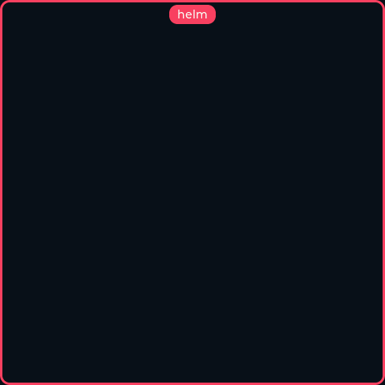
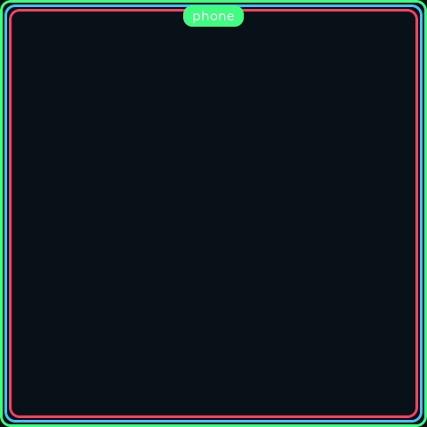
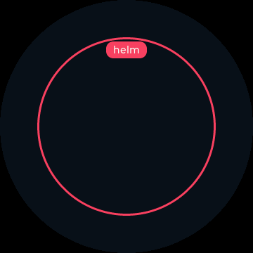
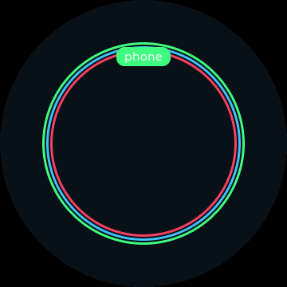

# espdisp Control Protocol

A **versioned, transport-agnostic peer-to-peer (P2P) control protocol** that lets
any *controller* (the knob, the SignalK plugin, a future phone app) discover and
control any *target display* directly — over **IP (primary)** and **BLE
(fallback)** — without routing through the SignalK manager.

The protocol is defined once as a JSON Schema and code-generated into a **C++
library** (firmware: displays + knob + harness) and a **JS library**
(`@espdisp/proto`, used by the SignalK plugin), kept in lockstep by shared
conformance fixtures.

> Design spec:
> [`superpowers/specs/2026-06-13-espdisp-control-protocol-design.md`](superpowers/specs/2026-06-13-espdisp-control-protocol-design.md).
> Implementation plan:
> [`superpowers/plans/2026-06-13-espdisp-control-protocol.md`](superpowers/plans/2026-06-13-espdisp-control-protocol.md).

## 1. Overview & roles

Every device speaks the protocol in one or both of two roles:

| Role | Behaviour |
|------|-----------|
| **controller** | Discovers targets, **attaches** a control session, **switches** the target's active view, **heartbeats** to keep the session alive, and **detaches**. The knob, the plugin, and the test harness are controllers. |
| **target** | Maintains a session table, applies switches (last-writer-wins), and renders a **per-controller colored frame** while controlled. Every display is a target. |

A display advertises `role:both` — it is always a target and remains
controller-capable for future use. The system is **many-to-many**: several
controllers may drive several targets, and one target may have several
concurrent controllers.

## 2. Message types & envelope

All messages share an envelope `{ "v": "<major>.<minor>", "t": "<type>", ... }`,
where `v` is the protocol version and `t` is the message type. The authoritative
definition of every field is the JSON Schema:

- **Schema (source of truth):** [`proto/schema/espdisp-control-1.schema.json`](../proto/schema/espdisp-control-1.schema.json)
  — JSON Schema draft 2020-12, carrying `x-proto-major` / `x-proto-minor`.
- **Conformance fixtures:** [`proto/fixtures/*.json`](../proto/fixtures) — real
  example messages (valid, incompatible-major, forward-compat) loaded by **both**
  the C++ and JS test suites.

The core message and record types (informative — the schema is authoritative):

| Type (`t`) | Direction | Purpose |
|------------|-----------|---------|
| `DeviceRecord` (no `t`; discovery record) | target → anyone | `deviceId`, `name`, `role`, `board`, `display` (`WxH`), `currentView`, `views: [{id,title}]`, `transports` (`ip`/`ble`), `authRequired`. |
| `attach` | controller → target | `controllerId`, `name`, `color` (`#RRGGBB`), optional `key`, `ttlMs`. |
| `attachAck` | target → controller | `accepted`, `sessionId`, `ttlMs`, optional `reason`, and the target's `DeviceRecord`. |
| `switch` | controller → target | `sessionId`, `viewId`. |
| `switchAck` | target → controller | `ok`, `currentView`, optional `reason`. |
| `heartbeat` / `heartbeatAck` | controller → target | `sessionId` → `{ok, ttlMs}`. |
| `detach` / `detachAck` | controller → target | `sessionId` → `{ok}`. |
| `controlState` | target → anyone | `currentView` + active `sessions: [{controllerId,name,color,lastSeen}]`. Drives the target's frame and a controller's "who else is here" view. |

Example `attach` → `attachAck` exchange (from the fixtures):

```json
{"v":"1.0","t":"attach","controllerId":"knob-aa01","name":"Helm knob","color":"#00bcd4","key":"hunter2","ttlMs":10000}
```

```json
{"v":"1.0","t":"attachAck","accepted":true,"sessionId":"s-7","ttlMs":10000,
 "device":{"v":"1.0","deviceId":"mfd-helm","role":"display","currentView":"wind",
   "views":[{"id":"wind","title":"Wind"},{"id":"nav","title":"Nav"}],
   "transports":["ip","ble"],"authRequired":true}}
```

## 3. Versioning & compatibility

- Every message carries `v` = `"<major>.<minor>"`. **Same `major` is required**;
  a higher `minor` is backward-compatible, and **unknown fields are ignored**
  (forward-compat). A `major` mismatch is rejected — over IP the target returns
  HTTP `400 {"error":"incompatible_version"}`.
- `x-proto-major` / `x-proto-minor` live in the schema and flow into both
  codegens (`proto::kProtoMajor` / `kProtoMinor` in C++, `PROTO_MAJOR` /
  `PROTO_MINOR` in JS), so the constant cannot drift from the wire format.
- Discovery advertises the protocol version (`pv` in the mDNS TXT record) so a
  controller can filter incompatible targets before attaching.

Current version: **1.0**.

## 4. Auth (optional shared key)

Control may be gated by a **system shared key** (a simple password):

- On firmware it is stored in NVS namespace `proto`, key `key`. **Empty key =
  open** (control accepted from anyone — today's behaviour). When a key is set,
  `attach` (and inbound control) must carry a matching `key` or are denied.
- Discovery stays open; records advertise `authRequired:true` so a controller
  knows to present the key.
- Set or clear it with the `ctl key` console command (see [§10](#10-ctl-config-commands)).
  The key is **never echoed** back over serial/BLE.

This is **local-network trust** (LAN/BLE), not internet-grade auth — documented
as such.

## 5. Sessions, last-writer-wins & the colored frame

### Session lifecycle (many-to-many, lightweight)

- A controller `attach`es → the target creates a session keyed by `sessionId`,
  recording `{controllerId, name, color, lastSeen}`. Multiple concurrent
  sessions per target are allowed (`kMaxSessions = 8`).
- `switch` applies **last-writer-wins** to the active view — no exclusive lock.
- `heartbeat` (sent every `ttlMs/2`) keeps the session alive; a session with no
  heartbeat for `ttlMs` (default **10 s**) is **reaped**. `detach` ends it
  immediately.

The pure session-table logic (`proto::SessionTable`: attach / heartbeat / detach
/ reap / `to_control_state`) lives in
[`include/proto/proto.h`](../include/proto/proto.h) +
[`src/proto/proto.cpp`](../src/proto/proto.cpp) and is host-tested.

### The colored "controlled" frame (target-side LVGL overlay)

While a target is controlled it draws a **frame in each controlling controller's
color** with the most-recent controller's name on a small pill, so a glance shows
who is driving it:

- Rendered on `lv_layer_top()` so it survives screen swaps; built and mutated
  **only on the UI task** (the HTTP/BLE handlers post the session state; the UI
  task draws it). See `src/ui/control_frame.cpp`.
- Multiple concurrent controllers → **thin stacked nested borders**, one per
  session, outermost = most-recently-active. No active session → no frame.

Rendered headlessly by `make sim` at 480×480 square and 360 round, single and
three-controller:

<p align="center">
  
  
</p>
<p align="center">
  
  
</p>

## 6. IP binding (primary)

### Discovery — mDNS

Controllers browse the `_espdisp._tcp` service. Each display registers its own
service TXT (see `src/net.cpp`) including:

- `pv` = `"1.0"` (protocol version) and `role` = `"both"`,
- plus `device_id`, `board`, `firmware`, `version`, `path`.

A controller reads `pv`/`role` from the TXT to filter incompatible targets before
attaching, then completes the `DeviceRecord` with a `GET /api/p2p/device`.
(Firmware-side browse: `src/proto_discovery.cpp`.)

### Control — versioned HTTP/JSON

The IP binding is the versioned HTTP/JSON surface served by the target's Arduino
`WebServer` (registered in `src/web.cpp`, handled in `src/proto_target.cpp`).
These endpoints are gated by the protocol shared key inside the message (not the
web-admin token), so peer controllers can attach without the admin credential:

| Method & path | Request body | Response |
|---------------|--------------|----------|
| `GET /api/p2p/device` | — | `DeviceRecord` |
| `POST /api/p2p/attach` | `attach` | `attachAck` |
| `POST /api/p2p/switch` | `switch` | `switchAck` |
| `POST /api/p2p/heartbeat` | `heartbeat` | `heartbeatAck` |
| `POST /api/p2p/detach` | `detach` | `detachAck` |
| `GET /api/p2p/state` | — | `controlState` |

Each handler parses the body with ArduinoJson → `proto::from_json` → checks
`proto::version_compatible` (else `400 incompatible_version`) →
`proto_target::handle_*` → serializes the ack with `proto::to_json`. The
controller-side IP client is `src/proto_ip.{h,cpp}` (`get_device`, `attach`,
`do_switch`, `heartbeat`, `detach`, `get_state`).

Example: switch the target to the `nav` view (after attaching):

```sh
curl -s -X POST http://espdisp.local/api/p2p/switch \
  -H 'Content-Type: application/json' \
  -d '{"v":"1.0","t":"switch","sessionId":"<sid>","viewId":"nav"}'
# -> {"v":"1.0","t":"switchAck","ok":true,"currentView":"nav"}
```

## 7. BLE binding (fallback)

Used only when the peer has **no reachable IP** (per the IP-primary rule).

### Target — espdisp Control GATT service

Alongside the existing NUS + CONNECTION/CONFIGURATION services, a target exposes
a **Control GATT service** (defined in `include/ble_config.h`, set up in
`src/ble_config.cpp`):

| Characteristic | UUID | Properties | Payload |
|----------------|------|------------|---------|
| **Service** | `a3f7e100-7a6b-4f47-b3a5-c4d2e5f6a000` | — | — |
| `DEVICE` | `a3f7e101-7a6b-4f47-b3a5-c4d2e5f6a000` | READ | `DeviceRecord` (summarized to ≤512 B — view list capped; full list via IP) |
| `CONTROL` | `a3f7e102-7a6b-4f47-b3a5-c4d2e5f6a000` | WRITE | `attach` / `switch` / `heartbeat` / `detach` JSON |
| `STATE` | `a3f7e103-7a6b-4f47-b3a5-c4d2e5f6a000` | READ + NOTIFY | `controlState` (notifies on change) |
| `RESP` | `a3f7e104-7a6b-4f47-b3a5-c4d2e5f6a000` | READ + NOTIFY | the ack JSON for the last `CONTROL` write (a BLE write returns no body, so the central reads the `sessionId` back here) |

The `CONTROL` write dispatches through the **same** `proto_target::handle_*`
path as the HTTP endpoints — one handler for both transports. Incompatible-major
writes are rejected. Values are written with the `setValue(const uint8_t*, len)`
overload (memory-trap rule), and the Control service UUID is advertised in the
**scan response** to stay within the BLE adv budget.

### Controller — on-demand BLE central

A controller (knob / harness) stays a **peripheral** for its own provisioning and
becomes a **central only on demand**: scan for the Control service UUID → connect
**one peer at a time** → write `CONTROL(attach)`, read the ack from `RESP` →
`CONTROL(switch)` → `CONTROL(detach)` → **disconnect** and free the client. It
never holds an idle connection. This bounds NimBLE's internal-SRAM peaks to avoid
the documented starvation hang. Implementation: `src/proto_ble.{h,cpp}` (enabled
only on the `harness-s3-devkitc` and `waveshare-knob-1_8` envs, which set the
NimBLE central role).

## 8. Shared libraries

One schema, two generated libraries, shared fixtures:

| Artifact | Location | Contents |
|----------|----------|----------|
| Schema (source of truth) | `proto/schema/espdisp-control-1.schema.json` | every message/record type; `x-proto-major/minor` |
| Fixtures | `proto/fixtures/*.json` | conformance vectors loaded by both suites |
| **C++ generated records** | `include/proto/records_generated.h` | POD structs + ArduinoJson `from_json`/`to_json` (generated by `proto/gen/gen_cpp.py`, checked in) |
| **C++ pure logic** | `include/proto/proto.h`, `src/proto/proto.cpp` | version/compat, auth, the session table |
| **JS lib** `@espdisp/proto` | `proto/js/` | `ajv` validators + version/auth helpers; TS types generated by `proto/gen/gen_ts.mjs` |

Regenerate both with:

```sh
make proto    # python3 proto/gen/gen_cpp.py  +  proto/js gen_ts.mjs
```

CI checks freshness with `make proto && git diff --exit-code
include/proto/records_generated.h proto/js/types.d.ts`.

Conformance is enforced by both suites loading `proto/fixtures/*.json`:

```sh
pio test -e native -f test_proto          # C++ (Unity)
cd proto/js && npm test                   # JS (node:test)
```

## 9. Consumers

| Consumer | Role | Notes |
|----------|------|-------|
| **Knob** (`waveshare-knob-1_8`) | controller | Select-Display → Select-View routes through the protocol — IP attach/switch/detach via the manager worker task, on-demand BLE central when off-grid. Carries the knob's configured color + the shared key. |
| **Displays** (`esp32-4848s040`) | target (`role:both`) | Serve `/api/p2p/*` + the Control GATT service, maintain the session table, render the colored frame. |
| **SignalK plugin** | controller | Migrated onto `@espdisp/proto` — `signalk/plugins/signalk-espdisp-manager/lib/proto-control.js` discovers via `GET /api/p2p/device` (validated, version-filtered) and controls via `POST /api/p2p/{attach,switch,detach}`, every message validated by the ajv validators. |
| **Headless harness** (`harness-s3-devkitc`) | controller | The on-hardware verifier in place of the knob — see [§11](#11-testing-with-the-esp32-s3-devkitc-1-harness). |

## 10. `ctl` config commands

The control-protocol identity commands are board-generic, reachable over **serial
and BLE** (via `net::dispatchCommand`), and persisted to NVS namespace `proto`.
Implemented in `src/main.cpp`, catalogued in `src/cmd_catalog.cpp`:

| Command | Effect |
|---------|--------|
| `ctl` or `ctl status` | Print this device's controller color and whether a shared key is set (the key value is never shown). |
| `ctl color #RRGGBB` | Set this device's controller color — the color of its frame when it drives another display (persisted, NVS `proto`/`color`). |
| `ctl key <secret>` | Set the shared control key that gates inbound control (persisted, NVS `proto`/`key`). |
| `ctl key clear` | Remove the key — control is open again. |

Example:

```text
ctl color #e91e63
ctl key hunter2
ctl status            # -> [ctl] color=#e91e63 key=set
```

## 11. Testing with the ESP32-S3-DevKitC-1 harness

The **`harness-s3-devkitc`** env is a headless controller on a bare
ESP32-S3-DevKitC-1 (no display, no LVGL/touch). It runs the same shared protocol
C++ library as the knob and is the **on-hardware verification vehicle** — it
loops `discover → attach → switch every view → heartbeat → detach` against a real
target. Source: `src/harness_main.cpp`.

### Build & flash

1. Set WiFi and (optionally) the target in `include/secrets.h`:
   ```c
   #define WIFI_SSID "your-ssid"
   #define WIFI_PASS "your-pass"
   ```
   The target base URL defaults to `http://espdisp.local`; override it at build
   time with `-D HARNESS_TARGET='"http://<target-ip>"'`.
2. Build and flash the harness:
   ```sh
   pio run -e harness-s3-devkitc
   pio run -e harness-s3-devkitc -t upload
   ```
3. Flash a Sunton display as the target:
   ```sh
   pio run -e esp32-4848s040 -t upload
   ```

### Two-node procedure (IP)

1. Power both boards on the same WiFi.
2. Watch the harness serial (`pio device monitor`, 115200). Each cycle must log:
   ```text
   [harness] wifi up <ip>, target http://espdisp.local
   [harness] target=<deviceId> views=<n>
   [harness] attached sid=<sid>
   [harness] switch <viewId> -> PASS      (one per view)
   [harness] cycle done
   ```
3. On the **display**, the harness's color (`#e91e63`, pink) frame must appear
   while attached and clear after detach / TTL timeout.
4. Confirm `GET /api/p2p/state` on the display reflects the harness session, and
   confirm last-writer-wins by running a second controller (e.g. `curl` against
   `/api/p2p/attach` then `/api/p2p/switch`) with a different color → stacked
   frames.
5. Soak the display while the harness loops:
   ```sh
   tools/espdisp.py soak --remote <user@server> --device-ip <display-ip>
   ```
   Expect PASS (no heap regression).

### BLE fallback test

The controller BLE central library (`src/proto_ble.cpp`) is compiled into the
harness env (which enables the NimBLE central role). With IP disabled to the
target (or the target reachable only over BLE), the controller must BLE-scan,
find the display by its Control service UUID, connect once, switch a view (frame
appears in the controller color), and disconnect — repeating in a loop. Run the
**NimBLE soak** with the central role enabled (the headline risk): the harness
BLE loop + the display for the soak duration must show no heap starvation or hang.

## Related docs

- [Deploy & use the remote knob](remote-knob.md) — the knob as a controller.
- [Knob: testing & simulation](knob-testing.md) — the harness as protocol
  verifier and the software/hardware verification split.
- [SignalK ESP Display Manager](signalk-espdisp-manager.md) — the plugin that
  now controls displays through this protocol.
