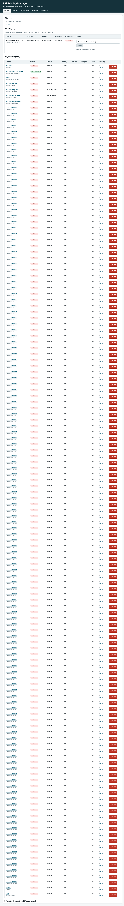
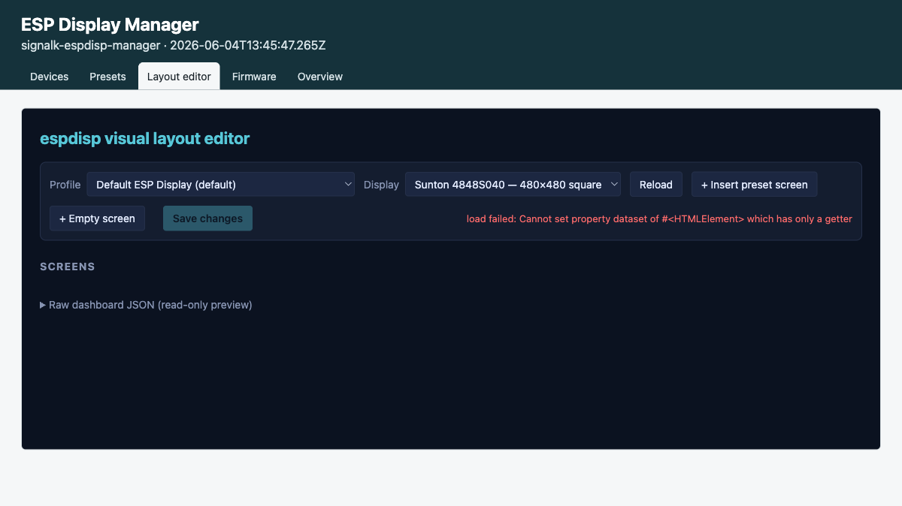
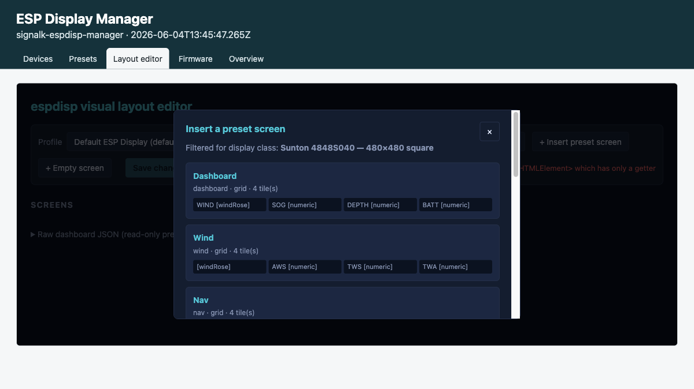
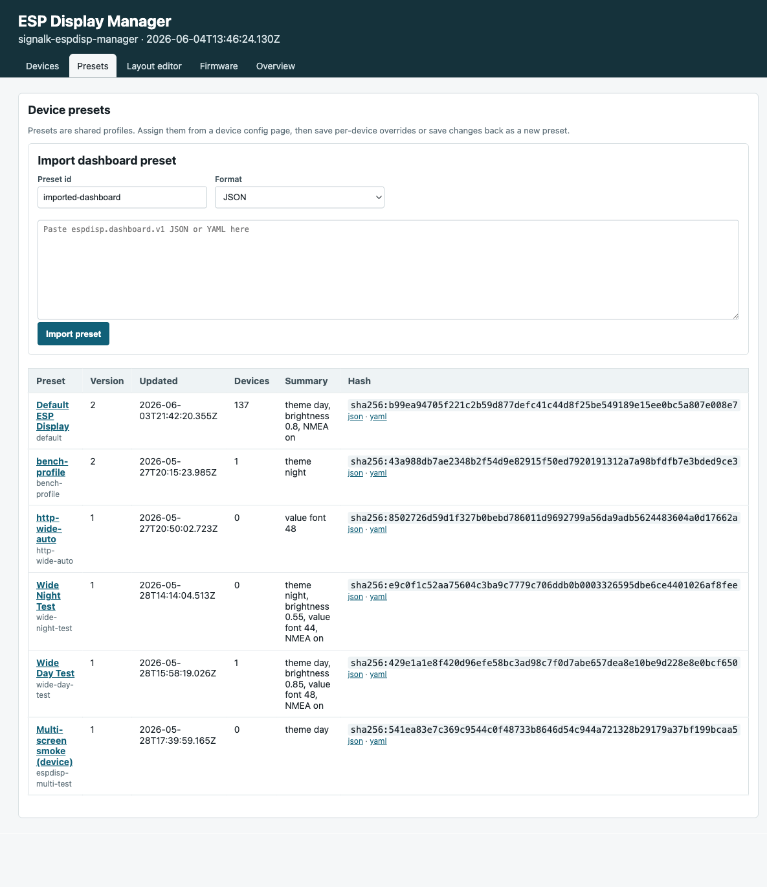
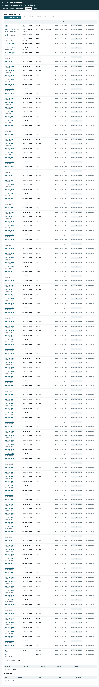

# Layout editor — live instrument screens builder

The SignalK ESP Display Manager plugin includes a browser-based editor
for building the screens shown on the boat's MFD. You pick a display
class, drop in preset screens or build your own, bind each tile to a
SignalK metric path, and push the result to the device. This guide
walks through the flow with screenshots.

## Getting to the editor

The plugin is bundled with `signalk-espdisp-manager`. Once the plugin
is installed and enabled in your SignalK server:

1. Sign in to the SignalK admin UI (default `http://<sk-host>:3000/admin/`,
   credentials `admin/admin` on a fresh install).
2. Navigate to **Webapps** → **ESP Display Manager**, OR go directly
   to `http://<sk-host>:3000/plugins/espdisp-manager/ui/devices`.

You'll land on the **Devices** tab. The top nav has:

- **Devices** — discovered + claimed ESP32 displays, with per-device
  status and actions.
- **Presets** — saved profiles (a profile bundles a layout + theme +
  alarm thresholds the manager pushes to a device).
- **Layout editor** — the visual builder (this guide).
- **Firmware** — catalog of firmware artifacts and OTA jobs.
- **Overview** — health dashboard.



## The editor at a glance

Open **Layout editor** from the top nav.



The page is split into a control bar at the top and a canvas below.

| Control | What it does |
|---|---|
| **Profile** dropdown | Pick which saved profile you're editing. The default profile is what new devices get when they first claim. |
| **Display** dropdown | Pick the target display class. Tile counts and grid dimensions reflow based on the screen geometry (Sunton 480×480 square fits 4 tiles in a 2×2 grid, Waveshare 800×480 fits 6 tiles in a 3×2 grid, etc.). |
| **Reload** | Re-fetch the saved profile from the server, discarding any unsaved edits. |
| **+ Insert preset screen** | Open the preset picker (next section). |
| **+ Empty screen** | Add a blank screen you'll populate tile-by-tile. |
| **Save changes** | Push the edited profile back to the manager. The next time a device on this profile heartbeats, the manager will tell it to fetch the new config. |

## Picking a display class

Display classes available today:

| Class | Resolution | Shape | Tiles per screen | Grid |
|---|---|---|---|---|
| `sunton-480` | 480 × 480 | square | 4 | 2 × 2 |
| `waveshare-4_3-800x480` | 800 × 480 | wide | 6 | 3 × 2 |
| `waveshare-5-800x480` | 800 × 480 | wide | 6 | 3 × 2 |
| `waveshare-5-1024x600` | 1024 × 600 | wide | 6 | 3 × 2 |
| `waveshare-7-800x480` | 800 × 480 | wide | 6 | 3 × 2 |
| `waveshare-7b-1024x600` | 1024 × 600 | wide | 6 | 3 × 2 |

Changing the display class **only changes the editor's grid** — it
doesn't migrate existing tile bindings. If you change from a 6-tile
to a 4-tile class, the extra tiles are dropped on save.

## Inserting a preset screen

Click **+ Insert preset screen**. A picker opens with the curated set
for the current display class:



Each preset has a fixed semantic id (`dashboard`, `wind`, `nav`,
`depth`, `steering`, `route`, `trip`, `autopilot`, `system`) and a
ready-made set of tile bindings. The firmware uses these ids to route
"go to wind screen" gestures and console commands.

Recommended starting set for a Sunton 480×480 in a "general sailing"
configuration:

1. `dashboard` — quad-grid with WIND, NAV, DEPTH, SYSTEM tiles
2. `wind` — fullscreen apparent wind rose
3. `nav` — large COG/SOG with HDG + position underneath
4. `depth` — large depth with water temp underneath

The picker lists every preset for the chosen display class; you pick
which to insert with one click.

## Per-tile field bindings

Every tile has at minimum a **primary metric path** (the big number
on the tile). Some widget types (compass, autopilot) also accept a
**secondary metric path** (e.g. CTS underneath the compass needle, or
target heading underneath the autopilot state).

The metric paths come from the standard SignalK path catalogue —
selecting a tile shows a `<datalist>` of common paths:

```
navigation.speedOverGround
navigation.courseOverGroundTrue
navigation.headingTrue
navigation.position
environment.wind.angleApparent
environment.wind.speedApparent
environment.wind.angleTrueGround
environment.wind.speedTrue
environment.depth.belowTransducer
environment.water.temperature
electrical.batteries.house.voltage
electrical.batteries.house.capacity.stateOfCharge
…
```

You can type any path here — autocomplete narrows the list, but a
custom path is accepted as long as it parses as a valid SignalK path
string. The device only renders what it knows how to render; an
unrecognised path shows `--` until a delta arrives.

## Widget types

Tiles are typed. The type determines the rendering and which
metric-path fields apply:

| Type | Primary | Secondary | Notes |
|---|---|---|---|
| `numeric` | required | — | Big number + unit |
| `compass` | required | optional | Needle + dial; secondary = CTS or target |
| `windRose` | required | — | Apparent or true wind angle |
| `gauge` | required | — | Arc gauge with min/max |
| `trend` | required | — | Sparkline of recent values |
| `bar` | required | — | Horizontal bar (e.g. tank level) |
| `text` | required | — | Just the value text, large |
| `autopilot` | required (state) | required (target) | Autopilot widget |
| `button` | n/a | n/a | Tap-to-action; binds to a command name |

## Presets tab

The **Presets** tab lists every saved profile. Click a profile to
edit its non-layout fields (theme, alarm thresholds, manager intervals).
For layout edits, use the Layout editor and pick the profile from the
top dropdown.



## Firmware tab

The **Firmware** tab is independent of the layout editor but lives in
the same plugin. It shows the firmware catalog (artifacts you've
uploaded), recent OTA jobs, and per-device OTA history.



To trigger an OTA from here:

1. Upload a `firmware.bin` to the catalog (drag-and-drop or via the
   upload form).
2. Open a device on the **Devices** tab.
3. Pick the new firmware version from the per-device firmware
   selector.
4. The manager queues a command; the device picks it up on the next
   command-poll cycle (default 10 s) and starts the OTA.

## Save & deploy

When you click **Save changes** in the layout editor:

1. The browser POSTs the updated dashboard doc to the plugin.
2. The plugin re-hashes the profile and bumps the config version.
3. Any device currently assigned to this profile sees a `desiredConfig`
   drift on its next heartbeat (default every 30 s) and fetches the
   new config.
4. The device applies the new layout on the LVGL task — no reboot
   needed.

End-to-end latency from **Save** to **visible on device** is usually
30–60 s, dominated by the heartbeat cadence.

## Troubleshooting

- **"load failed: Cannot set property dataset…"** on first open: known
  editor bug; click **Reload** once and the page initializes correctly.
- **Save is greyed out**: you haven't made any changes since the last
  load. Edit a tile or insert a screen and it lights up.
- **Tiles render `--` on device**: the SignalK server has no producer
  publishing on that path. Confirm by hitting
  `http://<sk-host>:3000/signalk/v1/api/vessels/self` and checking
  the path exists with a `value`. If you're in lab mode, start
  `tools/fake_boat.py` to inject synthetic deltas.
- **Editor changes don't show on device**: the device might be on a
  different profile. Check the Devices tab and confirm the
  `assignedProfile` matches what you edited.

## Direct API

For automation, every editor action has a JSON endpoint:

| Endpoint | Method | Use |
|---|---|---|
| `/plugins/espdisp-manager/presets/displays` | GET | List display classes |
| `/plugins/espdisp-manager/presets/widgets` | GET | List widget types + metric path metadata |
| `/plugins/espdisp-manager/presets/screens?displayClass=<id>` | GET | Curated preset screens for a class |
| `/plugins/espdisp-manager/profiles` | GET | All profiles |
| `/plugins/espdisp-manager/profiles/{id}` | GET / POST | Read or write a single profile (layout lives under `config.layout.screens`) |

All endpoints require both `Authorization: Bearer <signalk-jwt>` and
`X-EspDisp-Authorization: Bearer <devToken>` (the plugin's
`auth.devToken`, default `espdisp-dev` in `dev-shared-token` mode).
