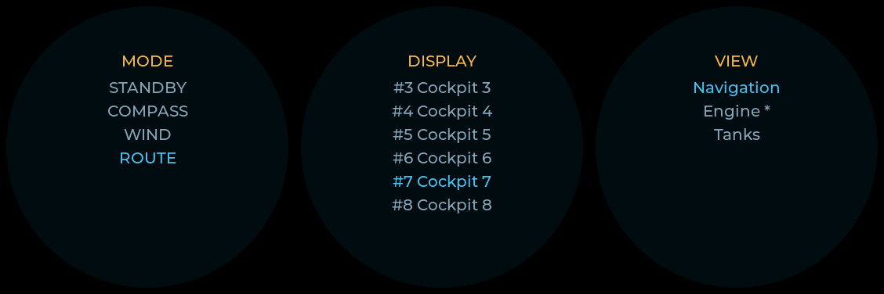

# Deploy & Use the Remote Knob

The **Waveshare ESP32-S3-Knob-Touch-LCD-1.8** (`waveshare-knob-1_8`) runs the
espdisp firmware as a **rotary remote controller**: a 360×360 round panel
driven by a rotary encoder + push button. It carries a small set of dedicated
round views and can switch the active view of **other** displays on the network
through the `espdisp-manager` plugin.

This guide covers flashing the firmware, provisioning the knob, confirming it
in the manager, and using its menu to control the autopilot and other displays.

> Prerequisite: the `espdisp-manager` plugin is installed and enabled on your
> SignalK server — see
> [Install the SignalK plugin](signalk-espdisp-manager.md#install-the-signalk-plugin).

## 1. Hardware

| Function | Detail |
|----------|--------|
| Module | Waveshare ESP32-S3-Knob-Touch-LCD-1.8 (JC3636K518) |
| MCU | ESP32-S3 — 16 MB flash + 8 MB PSRAM |
| Display | 1.8″ 360×360 **round**, ST77916 over Quad-SPI |
| Touch | CST816S capacitive (secondary; navigation is encoder-first) |
| Input | Rotary encoder (quadrature) + push button |
| Haptic | DRV2605 (optional click/select feedback) |

## 2. Flash the firmware

Over USB (the firmware build targets the `waveshare-knob-1_8` PlatformIO env):

```sh
pio run -e waveshare-knob-1_8 -t upload
```

or via the Makefile (which defaults `ENV` to the Sunton board, so pass it
explicitly):

```sh
make flash ENV=waveshare-knob-1_8
```

Once provisioned onto WiFi (below), subsequent updates can go over the air:

```sh
make ota ENV=waveshare-knob-1_8 DEVICE_IP=<knob-ip>
```

The device boots to the **Autopilot HUD**.

## 3. Provision the knob

Provisioning uses the serial console (`make monitor ENV=waveshare-knob-1_8`) or
BLE (`make ble`). The same commands work over either transport.

1. **Join WiFi and point at SignalK:**

   ```text
   wifi <boat-ssid> <boat-wifi-password>
   sk <signalk-host-or-ip> 3000
   ```

   (Each of these saves and reboots.)

2. **Set the device identity** — this is the name the knob advertises (mDNS,
   OTA hostname, and the label shown in the manager device list). Setting it
   reboots the device:

   ```text
   id helm-knob
   ```

   Use `id` to show the current id, or `id auto` to restore the
   hardware-derived default.

3. **Set the manager token** so the knob can authenticate to the
   `espdisp-manager` plugin and enumerate / command other displays:

   ```text
   manager-token <token>
   ```

   In the reference lab this is the shared development token `espdisp-dev`
   (`dev-shared-token` mode). On a real deployment, issue a per-device
   provisioning/bearer token from the manager and use that value instead. Use
   `manager-token clear` to remove it.

4. **Point the knob at the manager endpoint** (if it is not auto-discovered via
   mDNS):

   ```text
   manager-register http://<signalk-host>:3000
   ```

   On a network with multicast DNS you can instead run `manager-discover` to
   probe for the `_espdisp-mgmt._tcp` service and auto-set the endpoint.
   `manager-status` prints the current endpoint, auth state, and last register
   result.

## 4. Confirm it appears in the manager

1. Open the manager device list:
   `http://<server>:3000/plugins/espdisp-manager/ui/devices` (or
   **Server → Plugin Config → ESP Display Manager** in the SignalK admin).
2. The knob should appear under the id you set (e.g. `helm-knob`) with an
   `online` state once it has registered and started heart-beating.
3. If it does not show up, check `manager-status` / `manager-errors` on the
   device, confirm the token matches, and confirm WiFi + SignalK reachability
   (`ip`, `sk-status`).

## 5. Calibrating the encoder

The encoder feel — how many quadrature counts make one detent, and which way is
"clockwise" — is **tunable at runtime from the console**, so you can dial it in on
first power-up without reflashing. The commands work over serial
(`make monitor ENV=waveshare-knob-1_8`) or BLE (`make ble`), and the values
persist in NVS across reboots.

```text
knob status          # print the current counts-per-detent and invert state
knob counts <1-8>    # set encoder counts per detent (persisted)
knob invert <0|1>    # swap encoder rotation direction (persisted; 0/1 or off/on)
```

If one physical detent produces several scroll events (or none), adjust
`knob counts` until one detent = one event. If turning clockwise moves the
highlight/target the wrong way, flip `knob invert`. For the full bring-up
procedure and how this maps to the hardware risks it closes, see
[Knob: testing & simulation](knob-testing.md#hardware-bring-up-checklist-when-the-device-arrives).

## 6. Gesture cheat-sheet

The **Autopilot HUD** is home. Gestures there control the autopilot directly:

| Gesture | Action (Autopilot HUD / home) |
|---------|-------------------------------|
| Scroll | Adjust target heading ±1° (apparent wind angle in Wind mode) |
| Hold + scroll | Adjust ±5° |
| Click | Engage / disengage (toggle Standby ⇄ last active mode) |
| Long-press | Open the **mode picker** (Standby / Compass / Wind / Route) |
| Double-click | Open the **menu** (Select Display → Select View) |

Inside menus the vocabulary is uniform: **scroll** moves the highlight,
**click** selects/enters, **double-click** goes back one level.

The menu overlays — mode picker, Select Display (with list paging when there are
more entries than fit), and Select View — rendered at 360×360 by the `make sim`
harness:

<p align="center">
  
</p>

For how these screens are tested and rendered without hardware, see
[Knob: testing & simulation](knob-testing.md).

## 7. Drive the autopilot

From the Autopilot HUD:

1. **Adjust course/wind angle** — scroll to nudge the target ±1° (hold the
   button while scrolling for ±5°). In Standby this *pre-sets* the target, so
   the next engage holds it.
2. **Engage / disengage** — click to toggle between Standby and the last active
   mode.
3. **Change mode** — long-press to open the mode picker, scroll to
   Standby / Compass / Wind / Route, then click to engage that mode (or
   double-click to cancel and return home).

These reuse the same autopilot command path as the on-screen autopilot screen
(`steering.autopilot.state` and `steering.autopilot.target.headingTrue`).

## 8. Drive other displays

From the Autopilot HUD, **double-click** to open **Select Display**:

1. **Select Display** — scroll through the list (the knob itself plus the
   remote MFDs the manager knows about); click to enter one.
2. **Select View** — scroll through that display's available views; click to
   switch it to the highlighted view. The change applies instantly via the
   manager's `screen.set` command and the `network.espdisp.configPush`
   push-live path.
3. **Double-click** backs out one level (Select View → Select Display → home).

Selecting one of the knob's own views (Autopilot HUD, Compass, Wind, Big
number) changes what the knob shows when idle.

## 9. The four dedicated round views

<p align="center">
  
</p>

| View | Shows |
|------|-------|
| **Autopilot HUD** | Mode badge, big target heading, current HDG + delta. Home; the autopilot gestures above are active only here. |
| **Compass** | Round heading ring with HDG / COG. |
| **Wind angle** | Apparent wind angle on the round dial + AWS. |
| **Big number** | One large value (depth or SOG). |

## Related docs

- [Knob: testing & simulation](knob-testing.md) — what is verified in software vs.
  what needs the device, and the hardware bring-up checklist.
- [SignalK ESP Display Manager](signalk-espdisp-manager.md) — plugin design and
  the [plugin install section](signalk-espdisp-manager.md#install-the-signalk-plugin).
- [User Guide — Managing Displays from SignalK](user-guide-signalk.md) —
  day-to-day display/view/OTA operation.
- [README → Remote Knob](../README.md#remote-knob) — overview and screenshots.
