# User Guide — Managing Displays from SignalK

This guide covers day-to-day operation of espdisp displays through the
**SignalK `espdisp-manager` plugin**: updating dashboards/views, pushing a
view to a device, and updating firmware over the air. It assumes the plugin is
installed on your SignalK server and at least one device has registered.

> Lab note: in the reference lab the SignalK server runs on `mythra-nav`
> (Docker), the manager plugin is mounted at
> `/plugins/espdisp-manager`, and a synthetic data source (`fake_boat.py`,
> `fake-boat.service`) feeds live values for bench testing.

## 0. The display screens

The same firmware drives every supported panel size; the layout adapts to the
aspect ratio. The autopilot and wind screens use the reference glass-cockpit
HUD — a semicircular heading compass (white band, green rail, red cardinals,
amber target bug), a centered HDG readout with COG/SOG, a cross-track-error
strip, and clean numeric tiles. Wind keeps the full 360° rose (wind can come
from dead astern) with all numbers moved out to tiles. These renders come from
`make sim`, which runs the real screen code headlessly; the bigger panels are
simulated, the round knob view is the live autopilot control surface.

**Autopilot HUD** — 480×480 (square), 800×480 and 1024×600 (wide):

  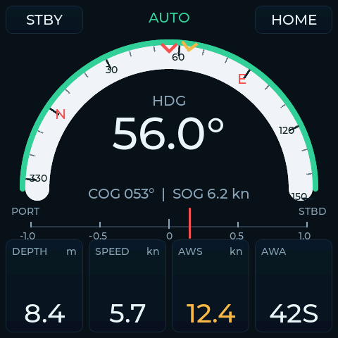
  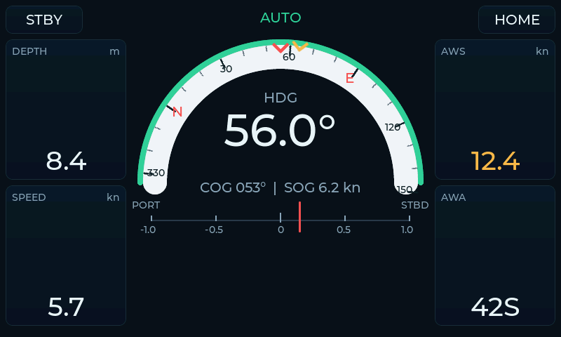
   
  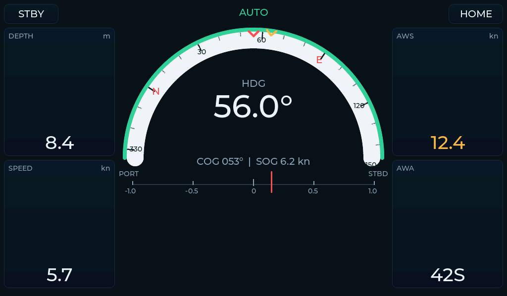

- **HDG** (big) with the **COG / SOG** sub-line; the amber bug on the rail is the
  autopilot's target heading, the red lubber at top is the boat's head.
- **XTE strip** shows cross-track error (PORT … STBD, ±1.0 nm).
- **ON / STBY** button engages or disengages; **long-press** it for the mode
  picker (Auto / Wind / Route / Standby). Tap the **port / starboard half** of
  the dial to nudge the target ∓1° (long-press for ∓10°). The external network
  knob controls the same autopilot in parallel.
- Tiles: **DEPTH · SPEED · AWS · AWA**.

**Wind dial** — 480×480, 800×480, 1024×600:

  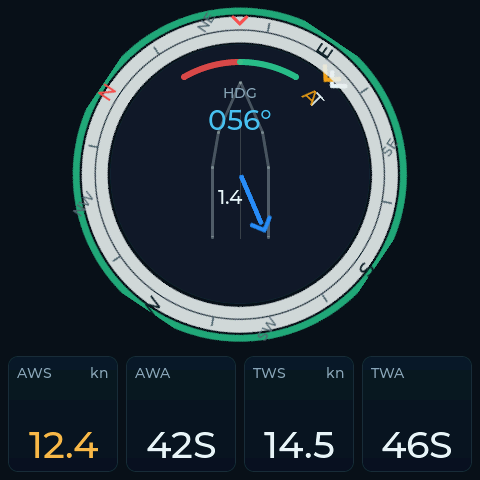
  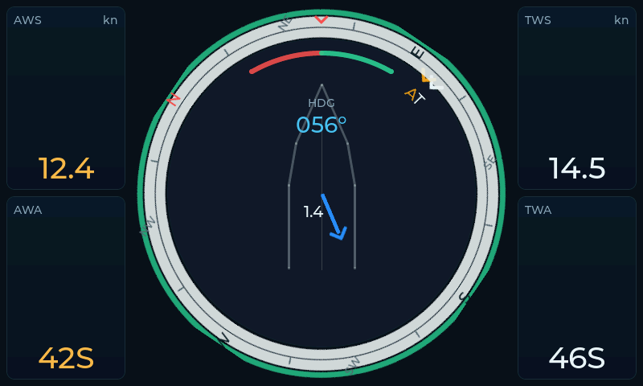
   
  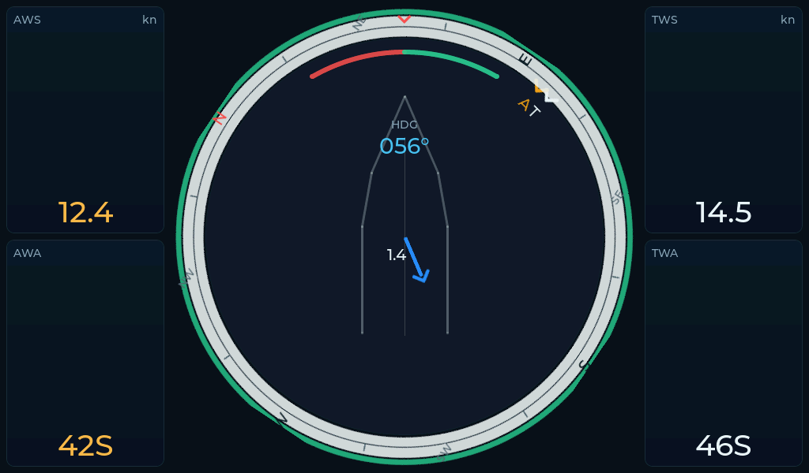

- Full 360° rose with **A** (apparent, amber) and **T** (true) wind indices, the
  red/green close-hauled sectors, the rotating heading bezel, and the blue tidal
  **current vector** at centre. Numbers are in tiles: **AWS · AWA · TWS · TWA**.
- The previous in-dial wind design is still registered as a separate
  **Wind (classic)** screen (swipe to it) so the two can be compared on device.

**Dashboard** and the **round autopilot control** (Waveshare knob, 360×360):

  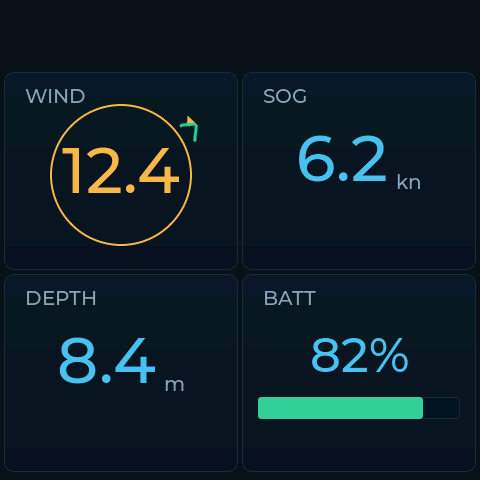
  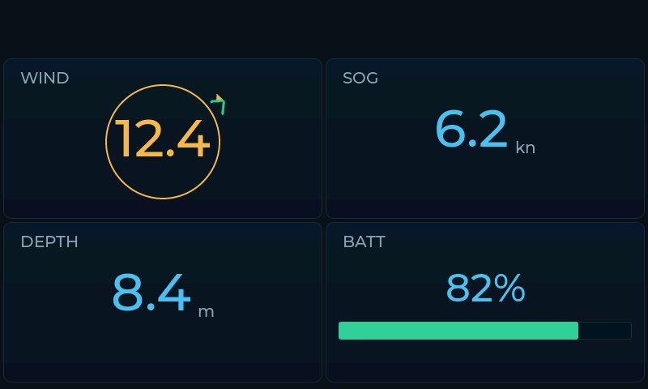
   
  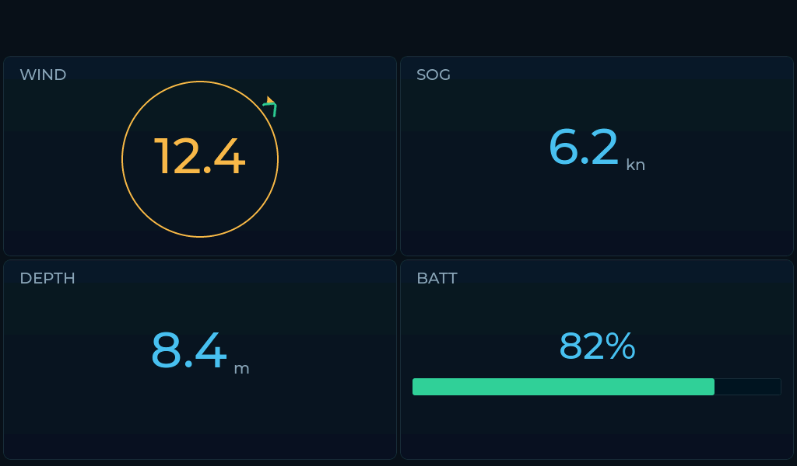
  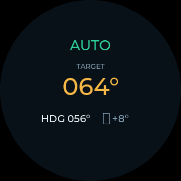

## 1. Opening the manager

1. Open the SignalK admin UI (`http://<server>:3000`) and log in.
2. Go to **Server → Plugin Config → ESP Display Manager**, or open the admin
   pages directly at `/plugins/espdisp-manager/ui/devices`.
3. The **Devices** list shows every registered display with its status: online
   state, IP/FQDN, firmware version, current config hash, last heartbeat, and
   recent errors.

Each device row links to:
- **Live status** — proxied `/api/state` (heap, WiFi, SignalK liveness).
- **Live logs** — proxied `/api/logs`.
- **Config** — the generated dashboard config currently applied.

> If a device shows as unreachable but is powered on, the manager now
> re-resolves its address across all known candidates (cached IP → mDNS FQDN),
> so a DHCP lease change no longer orphans it.

## 2. Editing a dashboard / view

Dashboards are composed of **screens**, each a grid of **tiles**, each tile a
**widget** bound to a SignalK path.

1. Open the **Layout Editor**
   (`/plugins/espdisp-manager/layout-editor.html`).
2. Pick the **display class** (resolution) matching your device — the editor
   constrains the grid and font sizes to what that panel supports.
3. For each tile choose:
   - **Widget type** — numeric, text, bar, gauge, compass, wind dial, trend,
     button, autopilot.
   - **SignalK path** — searchable dropdown (e.g.
     `navigation.speedOverGround`, `environment.wind.speedApparent`).
   - **Unit / precision / title**.
4. The preview pane renders the screen using the device's palette and fonts so
   what you see matches the panel.
5. **Save** to store the dashboard on the SignalK server. Saving can also queue
   a `config.reload` so the device picks it up.

Dashboards can be **exported/imported** as JSON or YAML for review and version
control (`/plugins/espdisp-manager/profiles/<id>/dashboard.json` /
`.yaml`).

## 3. Pushing a view to a device

To switch a specific device to a view/profile:

1. In the **Devices** list, open the device.
2. Assign a **profile/preset** (a reusable dashboard) or edit its dashboard
   directly.
3. Use **Apply / Reload** to queue a `config.reload` command. On its next poll
   (≤ the configured interval) the device fetches the new config, validates it
   against its display capabilities, and applies it transactionally — if the
   new config fails to parse or allocate, the device keeps the last-good
   dashboard rendering.
4. The device acks with the active config hash; the row shows the hash match so
   you can confirm the view is live.

Presets can be assigned to **several devices at once** (multi-device apply) for
identical helm repeaters.

## 4. Updating firmware from SignalK (OTA)

1. Build a firmware binary (`make build`, artifact at
   `.pio/build/<env>/firmware.bin`) or use a release asset.
2. In the manager, register the firmware in the **firmware catalog** (version,
   board, binary).
3. Create an **update job** targeting one or more devices.
4. On its next command poll the device pulls the binary over HTTP, flashes the
   inactive OTA slot, reboots, and on the first successful heartbeat posts a
   `/firmware/confirm` so the job is marked complete. A failed boot rolls back
   to the previous slot.

> OTA requires the device to be reachable on the network. The device's OTA
> endpoint is shown in its status (`<host>:3232`). On a flat lab network you
> can also flash directly: `make ota DEVICE_IP=<ip>`.

## 5. Health & troubleshooting

- **Soak / stability**: `tools/espdisp.py soak --remote <user@server>
  --device-ip <ip>` records reboots/stalls/heap to JSONL and prints a
  PASS/FAIL verdict. Run it on a host on the device's subnet.
- **Heap pressure**: `/api/state` exposes `heap_internal_free` and
  `heap_internal_largest` — the numbers that predict WiFi failures. Healthy is
  tens of KB free with a contiguous block well above ~8 KB.
- **Heartbeat classification**: `/api/state` `manager` block now reports
  `lastHeartbeatStatus` plus `heartbeatPreflightRefusals` /
  `heartbeatTransportFailures` so a looping heartbeat is diagnosable.
- **Reach a device on another subnet** for any HTTP/ping op: add
  `--remote <user@server>` to `espdisp.py` to relay through the SignalK host.

## 6. Using the rotary knob remote

The **Waveshare ESP32-S3-Knob 1.8** (`waveshare-knob-1_8`) is a round 360×360
**rotary remote**, not a full dashboard. It carries four dedicated round views
and can drive the autopilot and switch the active view on your other displays.

  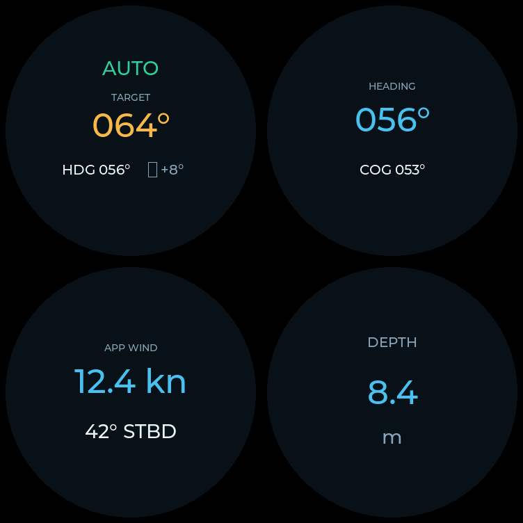

**The four views:**

- **Autopilot HUD** — mode badge, big target heading, current HDG + delta (home).
- **Compass** — round heading ring with HDG / COG.
- **Wind angle** — apparent wind angle on the round dial + AWS.
- **Big number** — one large value (depth or SOG).

**Controlling the autopilot** (from the Autopilot HUD, which is home):

- **Scroll** the knob to adjust the target heading ±1° (apparent wind angle in
  Wind mode); **hold the button while scrolling** for ±5°.
- **Click** to engage / disengage (toggle Standby ⇄ the last active mode).
- **Long-press** to open the mode picker (Standby / Compass / Wind / Route),
  scroll to a mode and click to engage it.

**Switching what other displays show:**

- **Double-click** to open the menu: **Select Display** (the knob itself plus
  your other MFDs) → click a display → **Select View** → click a view to switch
  that display to it. The change applies instantly. **Double-click** goes back a
  level.

Inside any menu: scroll moves, click selects/enters, double-click goes back.

For flashing and provisioning the knob, see
[Deploy & use the remote knob](remote-knob.md).

## Related docs

- [`docs/remote-knob.md`](remote-knob.md) — deploy & use the rotary knob remote.
- [`docs/layout-editor-guide.md`](layout-editor-guide.md) — layout editor walkthrough.
- [`docs/signalk-espdisp-manager.md`](signalk-espdisp-manager.md) — plugin design.
- [`docs/roadmap.md`](roadmap.md) — milestones.
